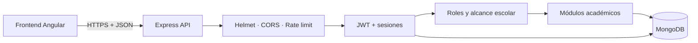
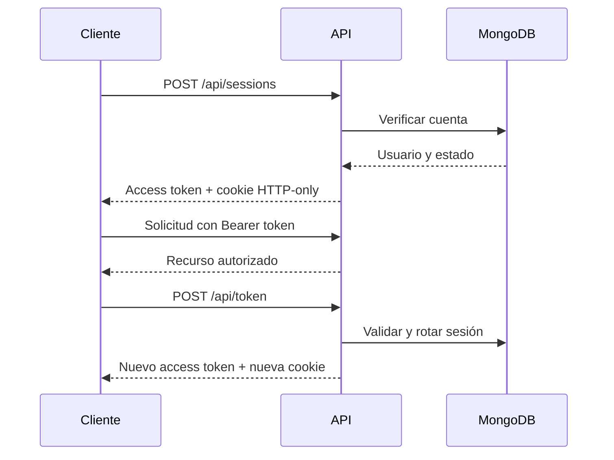

<div align="center">


# NovaSchool OS Backend

### El núcleo seguro, moderno y escalable para la gestión escolar

API REST construida con **Node.js**, **Express**, **TypeScript** y **MongoDB**.
Reúne autenticación robusta, administración académica y módulos operativos
en una base preparada para desarrollo local y producción.

<p>
  <a href="#-inicio-rápido">Inicio rápido</a> •
  <a href="#-arquitectura">Arquitectura</a> •
  <a href="#-módulos-de-la-api">API</a> •
  <a href="#-seguridad">Seguridad</a> •
  <a href="#-contribuir">Contribuir</a>
</p>


</div>

> [!IMPORTANT]
> Este fork moderniza SchoolOS Backend con validación estricta del entorno,
> sesiones reforzadas, mejor experiencia local, pruebas y documentación.
> La autoría y la licencia MIT del proyecto original se conservan.

## ✨ Lo más destacado

| Área | Incluye |
|---|---|
| 🔐 Autenticación | Access token, refresh token rotativo, cookies HTTP-only y cierre de sesiones |
| 🛡️ Seguridad | Helmet, CORS estricto, rate limiting, bcrypt, Zod y errores seguros |
| 🏫 Gestión escolar | Estudiantes, docentes, clases, horarios, asistencia, exámenes y notas |
| 💼 Operaciones | Pagos, anuncios, mensajería, biblioteca y recursos humanos |
| ⚙️ Desarrollo | TypeScript estricto, ESLint, Docker Compose, seeder y pruebas automatizadas |
| 🚀 Operación | Validación de variables, health check y apagado controlado de HTTP/MongoDB |

## 🧭 Arquitectura



La API espera la conexión con MongoDB antes de abrir el puerto HTTP. Al recibir
`SIGINT` o `SIGTERM`, cierra el servidor y la conexión de Mongoose de forma
ordenada.

## 🚀 Inicio rápido

### Requisitos

- Node.js 22 o una versión compatible
- npm
- MongoDB local, MongoDB Atlas o Docker

### 1. Instalar

```bash
git clone https://github.com/Luiscarranza13/SchoolOS-backend.git
cd SchoolOS-backend
npm ci
```

### 2. Configurar

Linux/macOS:

```bash
cp .env.example .env
```

PowerShell:

```powershell
Copy-Item .env.example .env
```

Genera dos secretos independientes para JWT:

```bash
node -e "console.log(require('node:crypto').randomBytes(48).toString('hex'))"
```

Completa los valores en `.env`. Nunca publiques ese archivo.

### 3. Iniciar MongoDB

Con una instalación local:

```dotenv
MONGO_URI=mongodb://127.0.0.1:27017/novaschool_os
```

O con Docker:

```bash
docker compose -f docker-compose.dev.yml up -d
```

### 4. Ejecutar

```bash
npm run dev
```

La API estará disponible en:

```text
http://localhost:5000/api
```

Health check:

```http
GET /api/health
```

## 🔧 Variables principales

| Variable | Descripción | Ejemplo local |
|---|---|---|
| `PORT` | Puerto del servidor | `5000` |
| `NODE_ENV` | Entorno de ejecución | `development` |
| `MONGO_URI` | Conexión a MongoDB | `mongodb://127.0.0.1:27017/novaschool_os` |
| `JWT_ACCESS_SECRET` | Secreto del access token, mínimo 32 caracteres | valor aleatorio |
| `JWT_REFRESH_SECRET` | Secreto del refresh token, mínimo 32 caracteres | valor aleatorio distinto |
| `JWT_ACCESS_EXPIRES_IN` | Duración del access token | `15m` |
| `JWT_REFRESH_EXPIRES_IN` | Duración de la sesión | `7d` |
| `CLIENT_URL` | Origen permitido por CORS | `http://127.0.0.1:4200` |
| `COOKIE_SAME_SITE` | Política SameSite | `lax` |
| `COOKIE_SECURE` | Cookies solo por HTTPS | `false` en local |

Consulta [`.env.example`](.env.example) para ver la configuración completa.

## 🧩 Módulos de la API

Todas las rutas parten de `/api`.

| Módulo | Ruta base | Capacidades |
|---|---|---|
| Usuarios | `/users` | Registro, perfil y administración de cuentas |
| Sesiones | `/sessions`, `/token`, `/logout` | Login, renovación y cierre de sesión |
| Estudiantes | `/students` | Altas, consultas, edición y eliminación |
| Docentes | `/teachers` | Gestión del personal docente |
| Clases | `/classes` | Clases y asignación de estudiantes |
| Horarios | `/timetables` | Planificación académica |
| Asistencia | `/attendance` | Registros individuales, masivos y resúmenes |
| Evaluación | `/exams`, `/grades` | Exámenes, calificaciones y resúmenes |
| Finanzas | `/fees` | Cuotas, pagos y estado por estudiante |
| Comunicación | `/announcements`, `/messages` | Anuncios y mensajería |
| Biblioteca | `/library` | Libros, préstamos y devoluciones |
| RR. HH. | `/hr` | Personal y resumen operativo |
| Administración | `/admin` | Dashboard protegido por rol |

## 🔐 Flujo de autenticación



El frontend debe usar `withCredentials: true` en registro, login, refresh y
logout; mantener el access token en memoria; y enviarlo como
`Authorization: Bearer <token>`.

## 🛡️ Seguridad

- Cookies de refresh HTTP-only con opciones centralizadas.
- Rotación de refresh tokens y almacenamiento exclusivo de su hash SHA-256.
- JWT con `issuer`, `audience`, expiración y `tokenVersion`.
- Rechazo de cuentas bloqueadas o inactivas.
- bcrypt con coste 12.
- Validación Zod para cuerpos de solicitud.
- Helmet, CORS con origen único y límites por IP.
- Errores de producción sin stack trace.
- Respuestas `400` para identificadores inválidos y `409` para conflictos únicos.
- Mutaciones académicas restringidas a administradores.

> [!WARNING]
> En producción usa HTTPS, secretos aleatorios, `NODE_ENV=production`,
> `COOKIE_SECURE=true` y una URI privada de MongoDB.

## 👤 Administrador inicial

Define estas variables únicamente en tu `.env`:

```dotenv
ADMIN_NAME=Nova School
ADMIN_USERNAME=novaschool.admin
ADMIN_EMAIL=admin@example.com
ADMIN_PASSWORD=replace-with-a-strong-password
```

Luego ejecuta:

```bash
npm run seed:admin
```

El seeder no duplica usuarios: crea la cuenta o promueve por correo una cuenta
existente, utilizando el mismo hash bcrypt del modelo.

## 🧪 Calidad y comandos

| Comando | Acción |
|---|---|
| `npm run dev` | Desarrollo con recarga automática |
| `npm run typecheck` | Verificación estática sin emitir archivos |
| `npm run lint` | Reglas ESLint para TypeScript y pruebas |
| `npm run build` | Compilación a `dist/` |
| `npm test` | Build y suite de pruebas |
| `npm run seed:admin` | Crea o promueve al administrador inicial |
| `npm start` | Ejecuta el build de producción |

## 🗂️ Estructura

```text
SchoolOS-backend/
|-- docs/assets/       # Recursos visuales del README
|-- scripts/           # Migraciones
|-- src/
|   |-- config/        # Entorno, cookies y base de datos
|   |-- controllers/   # Capa HTTP
|   |-- middlewares/   # Seguridad, roles y validación
|   |-- models/        # Modelos Mongoose
|   |-- routes/        # Endpoints REST
|   |-- scripts/       # Seeders
|   |-- services/      # Reglas de negocio
|   |-- utils/         # JWT, acceso y errores
|   `-- validators/    # Esquemas Zod
|-- tests/             # Pruebas de la aplicación
|-- docker-compose.dev.yml
|-- package.json
`-- tsconfig.json
```

## 🤝 Contribuir

Las propuestas son bienvenidas. Antes de enviar cambios:

```bash
npm run typecheck
npm run lint
npm test
```

Consulta [CONTRIBUTING.md](CONTRIBUTING.md) para conocer el flujo recomendado.

## 📜 Licencia y agradecimiento

Distribuido bajo la [licencia MIT](LICENSE).

Este trabajo parte de
[SchoolOS Backend](https://github.com/hamidukarimi/SchoolOS-backend), creado y
publicado como software de código abierto por
[Hamid Karimi](https://github.com/hamidukarimi).

Gracias a Hamid por construir la base original. Esta evolución se publica con
respeto por su autoría y con la intención de aportar mejoras a la comunidad.

---

<div align="center">

Hecho con TypeScript, una API clara y mucho cariño por la educación.

[⭐ Marca el proyecto con una estrella](https://github.com/Luiscarranza13/SchoolOS-backend) ·
[🐛 Reporta un problema](https://github.com/Luiscarranza13/SchoolOS-backend/issues) ·
[🤝 Propón una mejora](https://github.com/Luiscarranza13/SchoolOS-backend/pulls)

</div>
